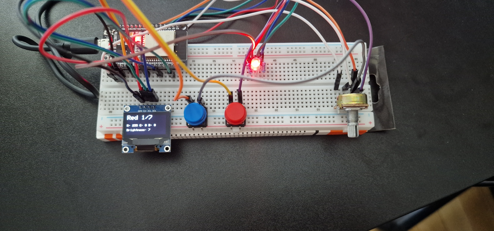
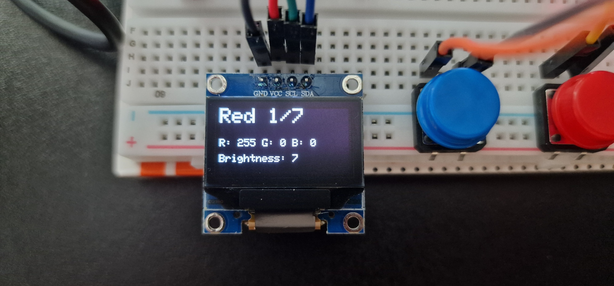

# RGB LED Color Controller with OLED and Potentiometer (ESP32)

This project allows you to control the **color** of an RGB LED using two **buttons** (next/previous color) and adjust the **brightness** using a **potentiometer**. An **OLED screen** displays the current color name, RGB values, and brightness level.

## 📦 Components Required

| Component                | Quantity |
|--------------------------|----------|
| ESP32 Dev Board          | 1        |
| Common Cathode RGB LED   | 1        |
| 220Ω Resistors           | 3        |
| B10K Potentiometer       | 1        |
| Push Buttons (4-pin)     | 2        |
| Breadboard + Wires       | 1        |
| Adafruit SSD1306 OLED    | 1        |

## 🔌 Wiring & Pinout

### RGB LED (Common Cathode)

| RGB Pin | ESP32 GPIO | Note                    |
|---------|------------|-------------------------|
| Red     | GPIO 25    | 220Ω resistor in series |
| Green   | GPIO 26    | 220Ω resistor in series |
| Blue    | GPIO 27    | 220Ω resistor in series |
| GND     | GND        | Connect to ESP32 GND    |

### Potentiometer

| Pot Pin  | ESP32 Pin | Description        |
|----------|-----------|--------------------|
| Left     | 3.3V      | VCC                |
| Middle   | GPIO 34   | Analog input (ADC) |
| Right    | GND       | Ground             |

### OLED Display (SSD1306 I2C)

| OLED Pin | ESP32 GPIO |
|----------|------------|
| VCC      | 3.3V       |
| GND      | GND        |
| SCL      | GPIO 22    |
| SDA      | GPIO 21    |

### Push Buttons

| Button Function | ESP32 GPIO | Description                |
|------------------|------------|----------------------------|
| Next Color       | GPIO 4     | Use INPUT_PULLUP           |
| Previous Color   | GPIO 5     | Use INPUT_PULLUP           |

## Wired ESP32

## 🧠 Features

- Select **color** from a preset list using **buttons**
- **Brightness** control via analog potentiometer (mapped to PWM)
- Live **OLED display** of:
  - Current color name
  - RGB values
  - Brightness level

## 🔧 Setup Instructions

1. Install the **ESP32 board** in the Arduino IDE.
2. Use board version **2.0.17** (tested stable).
3. Install the following libraries:
   - `Adafruit GFX Library`
   - `Adafruit SSD1306`
4. Copy the full Arduino sketch (`.ino`) into the IDE.
5. Connect components according to the wiring above.
6. Upload and run!

## OLED Display in Action

## 📝 Notes

- The RGB LED is **common cathode** (connect common pin to GND).
- Brightness is controlled independently; colors change only via button press.
- Includes debounce logic to prevent flickering when pressing buttons.
- Works best with 3.3V logic (ESP32 default) and 128x64 I2C OLED displays.

## 🖼️ Screenshot

The OLED will display something like:

